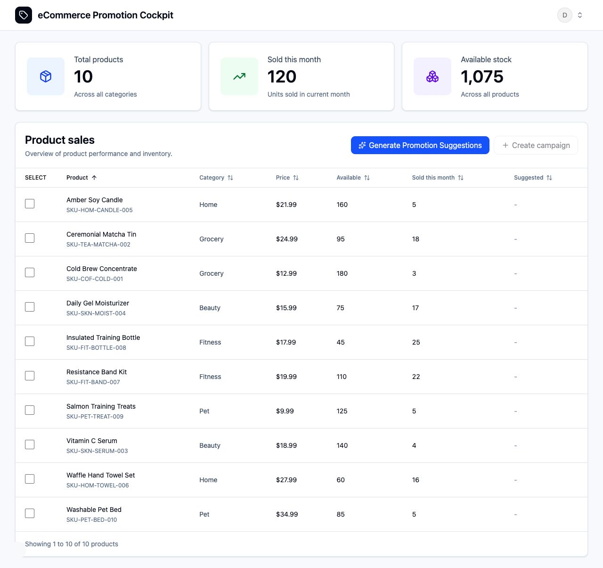

# ecom-promo-codex

The eCommerce Promotion Cockpit app is a small eCommerce demo where a Codex SDK-powered agent helps a store team decide which products need a promotion and then creates a campaign from real product context.



The app is intentionally narrow. It is not a generic chatbot and it is not trying to become a commerce platform. It is one practical workflow: look at product data, explain the recommendation, create the campaign, and save the result.

## Why This Exists

Most promotion workflows start with a blank brief or a rushed guess. This demo starts with product and sales data. A Codex SDK-powered agent inspects that context through small read-only MCP tools, recommends products that need campaign attention, and helps generate the campaign once the user chooses the offer terms.

The point is to show the Codex SDK used as an agent inside a real application workflow: authenticated UI, persisted data, scoped tools, generated campaign output, and campaign creative.

## Under The Hood

- A seeded demo login.
- SQLite persistence through Prisma.
- Read-only MCP tools for backend Codex product context.
- A Codex SDK agent for promotion suggestions and campaign generation.
- OpenAI image generation for campaign variants.
- Optional realtime voice control for the same UI workflow.
- A repo-scoped Codex App skill that can operate the local app APIs.
- A simple Next.js UI built with Tailwind CSS and shadcn-style components.

## Demo Features

- Products dashboard with inventory and sales context.
- Codex SDK-powered promotion suggestions from read-only product data.
- Campaign generation with discount, quantity limit, caption, image prompt, and saved campaign creative.
- Optional browser voice control for the same UI workflow.
- Optional Codex App skill workflow that uses the local app HTTP APIs.

This sample intentionally hardcodes the OpenAI models so the demo stays easy to review: `gpt-5.5` for the backend Codex SDK agent, `gpt-image-2` for campaign images, and `gpt-realtime-2` for voice.

## The Demo Flow

1. Sign in with the seeded demo account.
2. Open the products dashboard.
3. Click `Generate Promotion Suggestions`.
4. Open `View recommendation` on a suggested product.
5. Click `Create campaign` from the recommendation.
6. Review or adjust discount, quantity limit, and image variant count.
7. Click `Generate`.
8. Review the caption, image prompt, and campaign creative.

Voice control can also drive the same workflow from inside the browser.

## Run It Locally

Requirements:

- Node.js 20+
- pnpm 10
- one `OPENAI_API_KEY` with access to `gpt-5.5`, `gpt-image-2`, and `gpt-realtime-2`

If `pnpm` is not available yet, enable it once with Corepack:

```bash
corepack enable pnpm
```

Then run:

```bash
pnpm install
pnpm setup:demo
```

`pnpm setup:demo` creates `.env`, runs migrations, seeds the demo user/products, and verifies the seed data.

Add your OpenAI key to `.env`:

```text
OPENAI_API_KEY="..."
```

Start the app:

```bash
pnpm dev
```

Then open:

```text
http://localhost:3000
```

The seeded demo login is:

```text
Email: demo@promo.test
Password: demo-password
```

The Codex SDK agent, image generation, and realtime voice use the single server-side `OPENAI_API_KEY` from `.env`. The app never asks for the key in the browser. For voice, the browser receives only a short-lived realtime client secret.

For deterministic local mode, the Codex App skill, validation commands, and live smoke tests, see [Local Setup](docs/setup.md).

## Use From Codex App

The repo includes a Codex App skill at `.agents/skills/promo-campaign-studio`. It is a local demo skill: it uses the app APIs at `http://localhost:3000`, so the app must already be set up and running before the skill can do anything.

For this skill workflow, Codex App is the agent. The skill reads product data from the app APIs, Codex App decides the recommendation and campaign content, and the app only handles auth, persistence, and image generation. It does not use the app's backend Codex SDK recommendation/generation endpoints.

First finish the local setup above:

1. Run `pnpm install`.
2. Run `pnpm setup:demo`.
3. Add `OPENAI_API_KEY="..."` to `.env`.
4. Start the app with `pnpm dev`.
5. Confirm `http://localhost:3000` opens and the demo login works.

Then open a new Codex App thread and install the skill from this GitHub path:

```text
install the skill from here: https://github.com/mahesh0431/ecom-promo-codex/tree/main/.agents/skills/promo-campaign-studio
```

If Codex App asks for a local path instead, use `.agents/skills/promo-campaign-studio` from your checkout.

After the skill is installed, ask Codex App:

```text
use the promo-campaign-studio skill and find me the recommended products to run the promo
```

To create a saved campaign from its top recommendation:

```text
create the campaign for your recommendation
```

When the skill creates images, it should fetch the saved image from the app and render it inline in the Codex App response, not just return a localhost image URL.

The skill should stop and ask you to follow this README setup if `.env`, `OPENAI_API_KEY`, seeded data, login, or the local server is missing. It should not start the server, run setup, or switch to fake mode.

## Developer Workflow

Pull requests run deterministic CI through GitHub Actions: lint, typecheck, tests, and build. The repo also includes a Codex PR review workflow that runs `openai/codex-action@v1` against a generated PR patch and posts Codex feedback as a PR comment.

To enable Codex PR review, add `OPENAI_API_KEY` as a GitHub Actions repository secret. Codex review runs from the trusted workflow context on non-draft PRs, and the public repo is configured so only collaborators can create pull requests. CI should be treated as the merge gate; Codex review is an additional reviewer for bugs, workflow regressions, and demo-risk issues.

## Docs

- [Vision](VISION.md) and [Architecture](ARCHITECTURE.md) explain the idea and technical shape.
- [Docs](docs/README.md) maps setup, product docs, API smoke checks, and implementation plans.
- [Product docs](docs/product/README.md) cover workflow behavior, data, auth, Codex/MCP, images, voice, and UI references.
- [PLAN.md](docs/PLAN.md) explains how exact implementation plans are written; `docs/exec-plans/` stores active and completed plans.

## Project Boundaries

This is a demo app, not a commerce platform. It deliberately avoids signup, payments, Shopify integration, complex RBAC, queues, scheduling, approval workflows, and generic chat UI.

Dashboard sorting is client-side over the seeded demo dataset. Server-side sorting, filtering, and pagination are outside this demo scope.

## License

This project is open source under the [MIT License](LICENSE).
